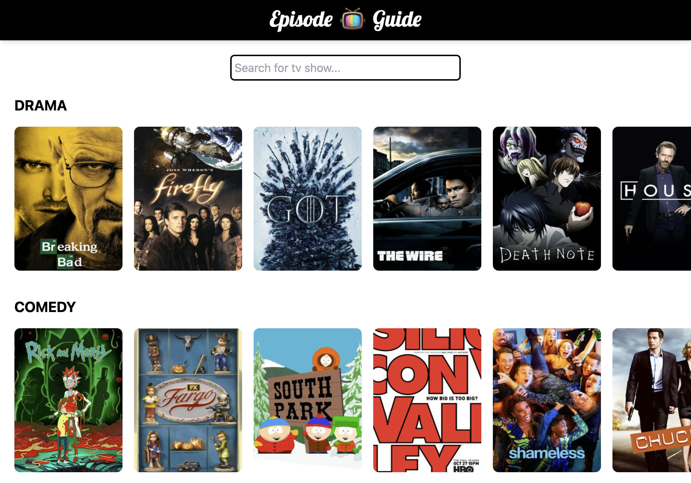

# Episode Guide

Simple app to discover popular TV shows. The app is consuming [tvmaze.com](https://www.tvmaze.com) API to get a list of TV shows. 

Demo app is available at: [episode-guide.dpserver.org](https://episode-guide.dpserver.org)



Vue 3 was used to implement the app.

It has many key qualities:

- Approachable - Builds on top of standard HTML, CSS and JavaScript with intuitive API and world-class documentation.
- Performant - Truly reactive, compiler-optimized rendering system that rarely requires manual optimization.
- Versatile - A rich, incrementally adoptable ecosystem that scales between a library and a full-featured framework.
- Community First - Not backed by huge corporations, moves in the direction to satisfy the community
- Enterprise proven - Used by many big names in various industries

The initial project setup was generated using the `create-vue` script, as an officially recommended way to start a new Vue application.
It is based on `vite` build tool, which provides good development experience and outstanding performance.

Additionally, the project setup includes:

- commitizen - to keep the format of the commit consistent
- git hooks setup with `husky`:
  - pre-push hook - to run linter and tests before every push to the repository
  - prepare-commit-msg - to force consistent commit messages format
- github actions - to run deployment pipeline on every main branch update


The application is hosted in an AWS S3 bucket and distributed via CloudFront CDN.

## Recommended Local Setup

Before starting, create `.env` file in the root of the project with `VITE_APP_API_URL` variable with a value set to `https://api.tvmaze.com`. Check the `.env.example` for the list of required environment variables.

Project setup tested with `NodeJS` latest LTS versions v18 and v20.

Recommended but not required code editor setup:

[VSCode](https://code.visualstudio.com/) + [Volar](https://marketplace.visualstudio.com/items?itemName=Vue.volar) (and disable Vetur) + [TypeScript Vue Plugin (Volar)](https://marketplace.visualstudio.com/items?itemName=Vue.vscode-typescript-vue-plugin).

## Type Support for `.vue` Imports in TS

TypeScript cannot handle type information for `.vue` imports by default, so we replace the `tsc` CLI with `vue-tsc` for type checking. In editors, we need [TypeScript Vue Plugin (Volar)](https://marketplace.visualstudio.com/items?itemName=Vue.vscode-typescript-vue-plugin) to make the TypeScript language service aware of `.vue` types.

If the standalone TypeScript plugin doesn't feel fast enough to you, Volar has also implemented a [Take Over Mode](https://github.com/johnsoncodehk/volar/discussions/471#discussioncomment-1361669) that is more performant. You can enable it by the following steps:

1. Disable the built-in TypeScript Extension
   1. Run `Extensions: Show Built-in Extensions` from VSCode's command palette
   2. Find `TypeScript and JavaScript Language Features`, right click and select `Disable (Workspace)`
2. Reload the VSCode window by running `Developer: Reload Window` from the command palette.

## Customize configuration

See [Vite Configuration Reference](https://vitejs.dev/config/).

## Project Setup

```sh
npm install
```

### Compile and Hot-Reload for Development

```sh
npm run dev
```

### Type-Check, Compile and Minify for Production

```sh
npm run build
```

### Run Unit Tests with [Vitest](https://vitest.dev/)

```sh
npm run test:unit
```

### Run End-to-End Tests with [Playwright](https://playwright.dev)

```sh
# Install browsers for the first run
npx playwright install

# When testing on CI, must build the project first
npm run build

# Runs the end-to-end tests
npm run test:e2e
# Runs the tests only on Chromium
npm run test:e2e -- --project=chromium
# Runs the tests of a specific file
npm run test:e2e -- tests/example.spec.ts
# Runs the tests in debug mode
npm run test:e2e -- --debug
```

### Lint with [ESLint](https://eslint.org/)

```sh
npm run lint
```
